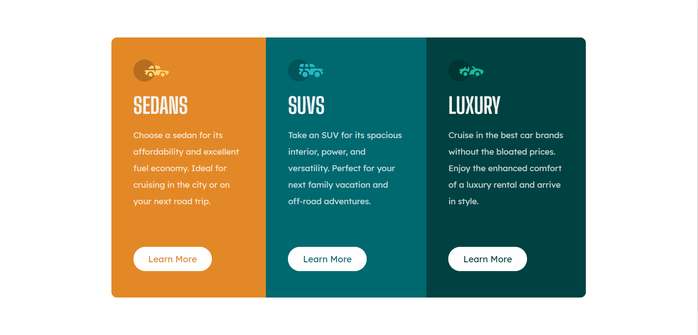

# Frontend Mentor - 3-column preview card component solution

This is a solution to the [3-column preview card component challenge on Frontend Mentor](https://www.frontendmentor.io/challenges/3column-preview-card-component-pH92eAR2-). Frontend Mentor challenges help you improve your coding skills by building realistic projects. 

## Table of contents

- [Overview](#overview)
  - [The challenge](#the-challenge)
  - [Screenshot](#screenshot)
  - [Links](#links)
- [My process](#my-process)
  - [Built with](#built-with)
  - [What I learned](#what-i-learned)
  - [Continued development](#continued-development)
  - [Useful resources](#useful-resources)
- [Author](#author)
- [Acknowledgments](#acknowledgments)

## Overview

### The challenge

Users should be able to:

- View the optimal layout depending on their device's screen size
- See hover states for interactive elements

### Screenshot



### Links

- Solution URL: [Github](https://github.com/joricky91/3-Column-Preview-Card)
- Live Site URL: [Live Site](https://3-columns-preview-card.netlify.app/)

## My process

### Built with

- Semantic HTML5 markup
- CSS custom properties
- Flexbox
- Mobile-first workflow

### What I learned

I learned 1 thing, that you could build the mobile version without using any flexbox, only padding. There are some cases that I don't have to use flexbox to design something actually. 

```
.container .card-sedans{
    padding: 30px;
    background-color: var(--bright-orange);
    border-radius: 10px 10px 0 0;
}
```

### Useful resources

- [tsbsankara Youtube Channel](https://www.youtube.com/watch?v=2Wy_MJPDfCw&t=1357s) - This helped me realizing that I don't really have to use flexbox to create mobile design.

## Author

- Frontend Mentor - [https://www.frontendmentor.io/profile/joricky91]
- Twitter - [https://twitter.com/joricky91]

## Acknowledgments

Thanks again to tsbsankara's Youtube Channel, the video really helps me out when I confused how should I use the flexbox, thank you very much.

